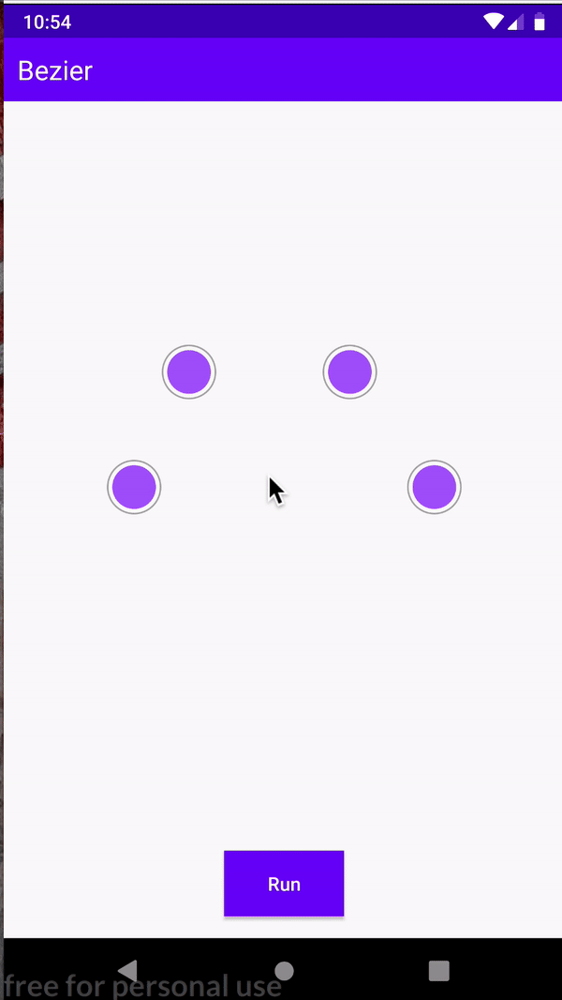
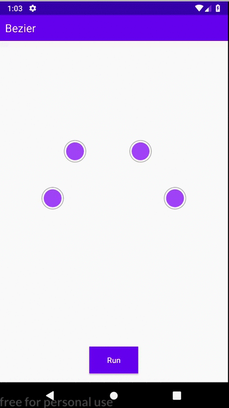
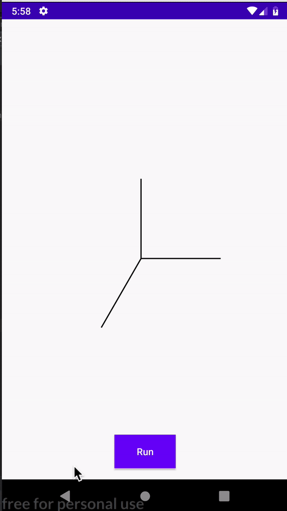
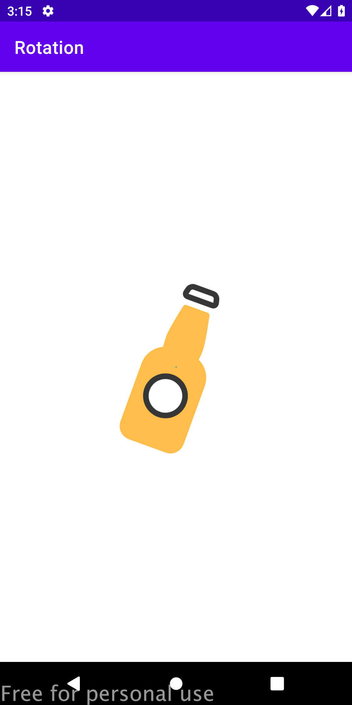

# Math-experiments
Collection of math experiments

### Experiments

- Bezier 
- Isometric
- Touch Event

 
 

### Inspiration

- [Flash Math Creativity](https://www.amazon.com/Flash-Math-Creativity-Keith-Peters/dp/1590594290)
- [Foundation-Actionscript-3-0-Animation-Making](https://www.amazon.com/Foundation-Actionscript-3-0-Animation-Making/dp/1590597915)
- [AdvancED ActionScript 3.0 Animation](https://www.amazon.com/AdvancED-ActionScript-Animation-Keith-Peters/dp/1430216085)

## References

- [Custom drawing](https://developer.android.com/training/custom-views/custom-drawing)
- [Canvas](https://developer.android.com/reference/android/graphics/Canvas)
- [Respond to touch events](https://developer.android.com/training/graphics/opengl/touch)

## Contributing and reporting issues

If you want to contribute in this repository, please send me a pull request or if you want to  report some issues please send  at  https://github.com/emedinaa/math-experiments/issues

I appreciate any question or comment. Also, if you consider it useful, you can give me a star ⭐ ⭐ ⭐.
